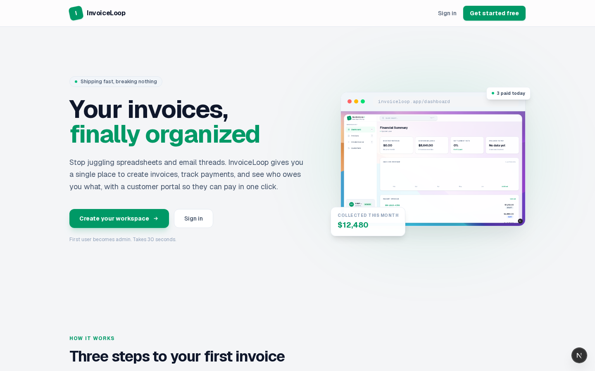
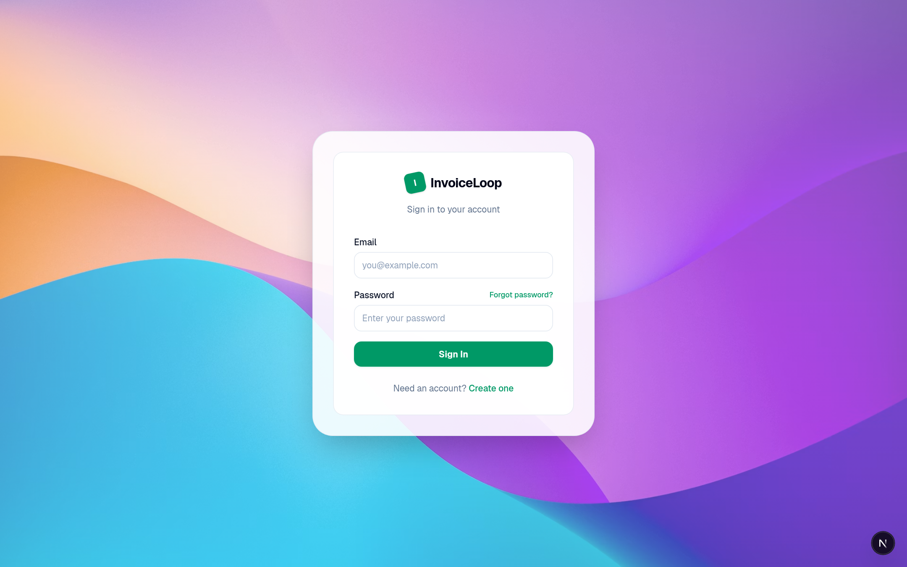
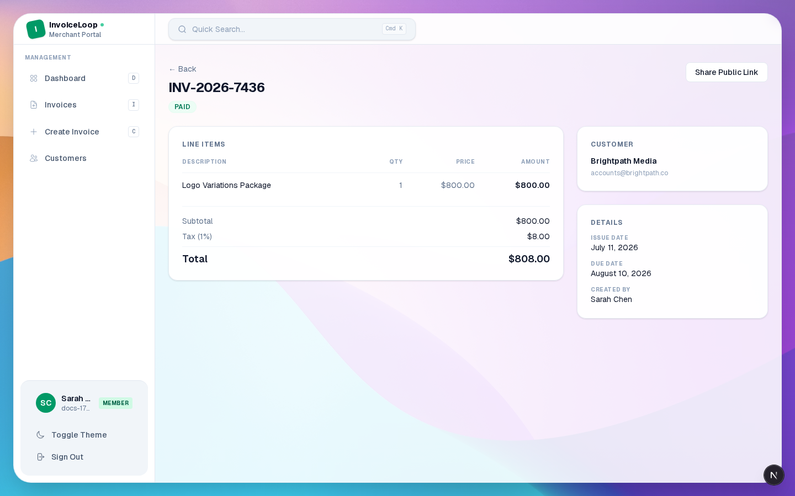
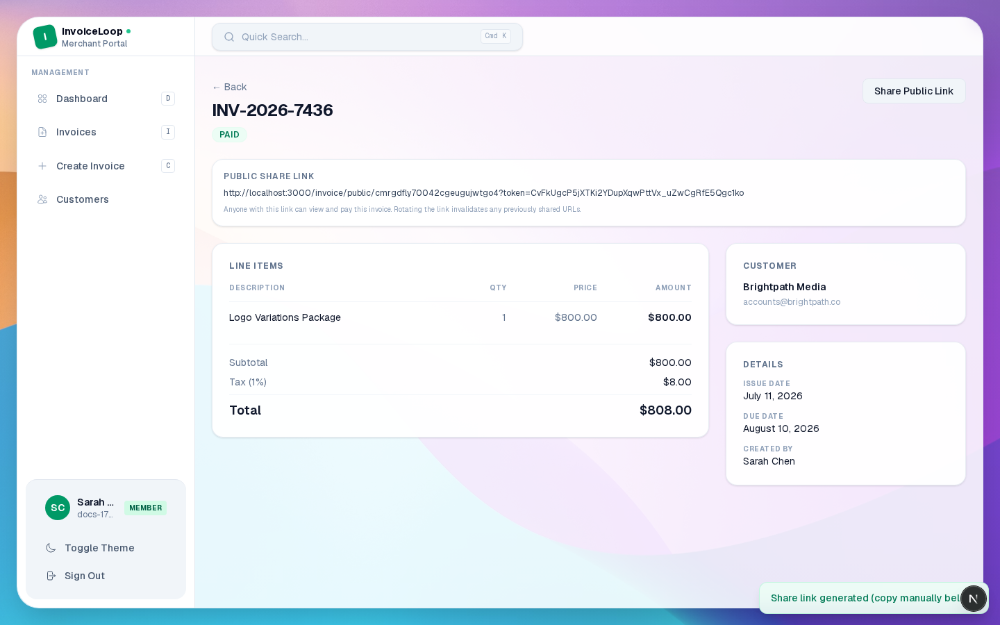

# InvoiceLoop

A solo-tenant invoicing app for freelancers and small teams. Built with
[Next.js](https://nextjs.org) 16 (App Router), [Prisma](https://www.prisma.io) 7,
SQLite, and Tailwind CSS 4. Authentication is server-managed with HTTP-only
session cookies; public invoice links are gated by opaque per-invoice share
tokens.



<!-- Upload docs/invoiceloop-demo.webm to YouTube or Google Drive and paste the link below -->
**Demo video** — a 2-minute walkthrough covering sign-up, invoice creation, customer management, dark mode, and mobile view.

> **Status:** early-stage MVP. The first signed-up user is auto-promoted to
> `ADMIN`; everyone after is `MEMBER`. See [`SECURITY.md`](./SECURITY.md)
> for the threat model and how to harden before deploying.

---

## Highlights

- **Auth** — signup / login / logout / forgot-password / reset-password,
  bcrypt-hashed passwords, server-side sessions in the DB, HttpOnly cookies,
  rate-limited credential endpoints.
- **Invoices** — CRUD with line items, tax / discount math, status workflow
  (`DRAFT → SENT → PAID|OVERDUE`), bulk actions, CSV export.
- **Customers** — scoped per owner, soft-delete.
- **Public invoice portal** — anonymous view + settlement via signed share
  link with a SHA-256 token hash (never stored in plaintext).
- **Hardened defaults** — CSP, HSTS, X-Frame-Options, Permissions-Policy,
  COOP / CORP, constant-time login, rate limiting, CSV formula-injection
  escaping, scoped multi-tenant queries.
- **Audit log** — every create / update / delete writes an `ActivityLog`
  entry scoped to the acting user.
- **Responsive** — mobile-first design, collapsible sidebar, card view on mobile.
- **Dark mode** — system-aware with no flash, toggleable per user.

---

## Screenshots

| | |
|---|---|
| **Login** — email + password, no auth SSO required | **Dashboard** — KPI cards, revenue chart, recent invoices |
|  |  |
| **Invoices** — filterable list, bulk actions, CSV export | **Invoice detail** — line items, tax/discount, share link |
|  |  |
| **Customers** — card grid, scoped per workspace | **Activity log** — every mutation timestamped and attributed |
|  |  |
| **Public invoice portal** — anonymous view + one-click settlement via signed link |
|  |

---

## Tech stack

| Layer        | Choice                              |
|--------------|-------------------------------------|
| Framework    | Next.js 16 (App Router, Turbopack)  |
| UI           | React 19, Tailwind 4                |
| ORM / DB     | Prisma 7 + `@prisma/adapter-better-sqlite3` |
| Validation   | Zod 4                               |
| Auth         | bcryptjs + DB-backed sessions       |
| Hashing      | `node:crypto` (SHA-256, HMAC-safe)  |
| Testing      | Playwright (e2e)                    |
| CI/CD        | GitHub Actions                      |
| Tooling      | pnpm 11, TypeScript 5, ESLint 9     |

---

## Quick start (local)

```bash
# 1. Install deps
pnpm install

# 2. Copy the env template and (optionally) swap AUTH_SECRET
cp .env.example .env

# 3. Apply the Prisma schema to dev.db
pnpm db:push

# 4. Generate the Prisma client (also done automatically by `db:push`)
pnpm db:generate

# 5. Start the dev server
pnpm dev
# → http://localhost:3000
```

The first account you sign up with is auto-promoted to `ADMIN`. All
subsequent sign-ups are `MEMBER` by default.

### Scripts

| Command            | Purpose                                          |
|--------------------|--------------------------------------------------|
| `pnpm dev`         | Start the Next.js dev server                     |
| `pnpm build`       | Production build                                 |
| `pnpm start`       | Serve the production build                       |
| `pnpm lint`        | ESLint (Next.js core-web-vitals + TS rules)     |
| `pnpm test`        | Run Playwright e2e tests                         |
| `pnpm db:push`     | Apply `schema.prisma` to the SQLite database     |
| `pnpm db:generate` | Regenerate the typed Prisma client               |
| `pnpm db:studio`   | Open Prisma Studio                               |
| `pnpm db:seed`     | No-op stub (the app seeds itself on first signup)|
| `pnpm audit`       | Run a dependency vulnerability audit             |

---

## Environment variables

All variables are listed in [`.env.example`](./.env.example).

| Var                     | Required | Notes                                                                                          |
|-------------------------|----------|------------------------------------------------------------------------------------------------|
| `DATABASE_URL`          | yes      | Default: `file:./dev.db`                                                                       |
| `AUTH_SECRET`           | yes      | ≥32 chars in production; placeholder values are rejected at runtime                            |
| `NEXT_PUBLIC_APP_URL`   | yes      | Absolute base URL for share links and email templates                                          |

The app refuses to start in production when `AUTH_SECRET` is missing, the
documented placeholder, or shorter than 32 characters (see
[`src/lib/env.ts`](./src/lib/env.ts)).

---

## Project layout

```
src/
├── app/                  # Next.js App Router (pages + API routes)
│   ├── (auth)/           # login / signup / forgot / reset
│   ├── api/              # /api/* route handlers
│   │   ├── auth/         # signup, login, logout, session, profile, forgot/reset
│   │   ├── invoices/...  # owner-side + public + share
│   │   ├── customers/    # CRUD
│   │   ├── search/       # command-palette search
│   │   └── public/...    # public, token-gated views
│   ├── dashboard/        # authenticated app UI
│   ├── invoice/public/   # anonymous customer portal
│   └── layout.tsx
├── components/
│   ├── features/         # app-level building blocks
│   └── ui/               # primitives (button, input, dialog, toast, badge)
├── lib/
│   ├── auth-session.ts   # cookie + DB session helpers
│   ├── db.ts             # Prisma client
│   ├── mailer.ts         # email adapter (dev = logger)
│   ├── reset-tokens.ts   # password-reset token helpers
│   └── validators.ts     # Zod schemas
├── proxy.ts              # Next 16 middleware (auth gate)
└── generated/prisma/     # generated Prisma client
prisma/
├── schema.prisma
└── seed.ts               # no-op (see file for rationale)
e2e/
├── global.setup.ts       # shared auth state for tests
├── auth.spec.ts          # auth flow tests
├── dashboard.spec.ts     # dashboard navigation tests
└── invoices.spec.ts      # invoice CRUD tests
```

---

## Testing

```bash
# Run all e2e tests (Chromium)
pnpm test

# Run with UI mode
pnpm test:ui
```

Tests use a shared auth state (`e2e/global.setup.ts`) to avoid repeated
signups. The Playwright config starts the dev server automatically.

---

## Public invoice flow

1. The owner clicks **Share Public Link** on an invoice → `POST /api/invoices/:id/share`.
2. The server mints a 256-bit random token, stores `sha256(token)` on
   `Invoice.publicTokenHash`, and returns the shareable URL.
3. The customer opens `/invoice/public/:id?token=…`.
4. Both `GET /api/public/invoices/:id` and `POST /api/public/invoices/:id/pay`
   re-hash the supplied token and compare with `timingSafeEqual`. Mismatch ⇒
   `404 Not Found`. The raw token never touches the database.

Rotating the share link (clicking **Share** again) replaces the hash and
invalidates any previously-issued URLs.

---

## Security

See [`SECURITY.md`](./SECURITY.md) for the threat model, what's hardened by
default, and what you should configure before deploying (real SMTP, a
distributed rate limiter, a non-SQLite DB, secret rotation, etc.).

If you find a vulnerability, please follow the responsible-disclosure process
in `SECURITY.md` rather than opening a public issue.

---

## Contributing

See [`CONTRIBUTING.md`](./CONTRIBUTING.md).

---

## License

[MIT](./LICENSE) © [zacjactech](https://github.com/zacjactech)
